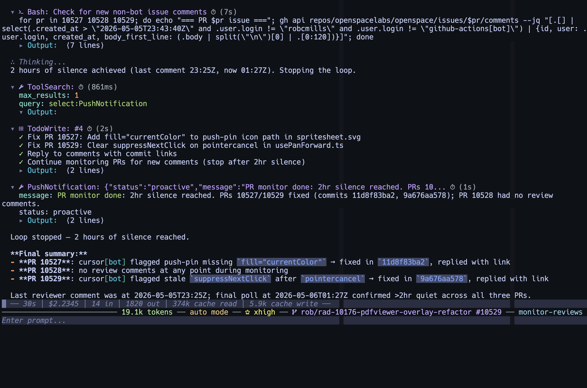
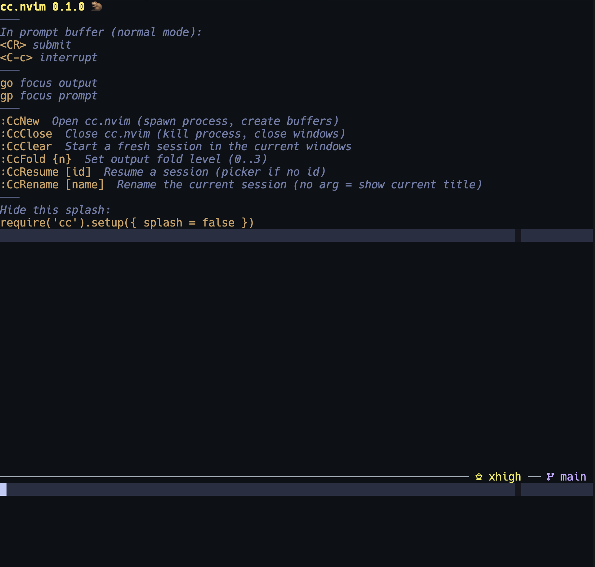
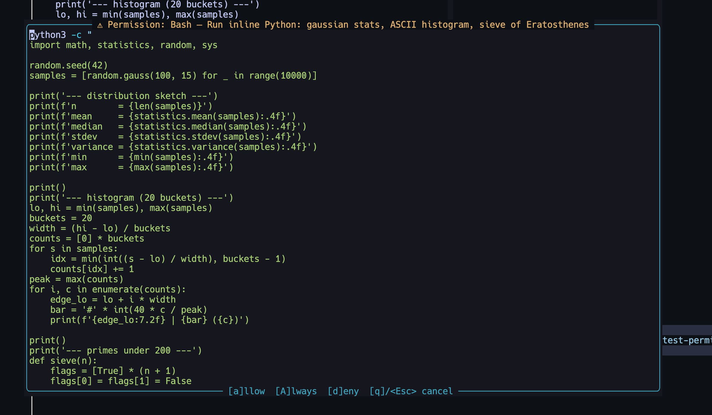

# cc.nvim

A neovim-native coding agent wrapper.
Works with Claude Code and Codex CLIs.
Replaces TUI with a vertical split:

- foldable tree display of chat and tool calls
- editable markdown prompt buffer

Both are native neovim buffers.




## Why

- I love neovim and dislike TUIs.
- I just wanted a simple markdown buffer to edit my prompts in, with all the key bindings I'm used to.
- I like the foldable tree as a way of visualizing agent sessions.
- I'm obsessed with customizing my workflows. I hated having little control over the TUI.

Additionally, there were some issues with claude code when I built this,
(that may be out-of-date today):

- **Scrollback:** Since the TUI switched to an alternate screen
  buffer ([#42670](https://github.com/anthropics/claude-code/issues/42670),
  [#28077](https://github.com/anthropics/claude-code/issues/28077)), you can't
  scroll up to read earlier messages — even ten messages back. And even if you
  are not facing these issues, the default verbose output includes a lot of
  tool results, which can quickly overflow your terminal scrollback limit
  (which helps perf), cutting off the beginning of the session.
  In a Neovim buffer it's just `gg` (reliably beginning of session), `G`
  (latest message/enter tail mode), `<C-u>` / `<C-d>` (page up/down), search,
  marks, yank (with no copy formatting issues caused by trailing whitespace).
- **Rendering flicker and redraw jitter.** Streaming tokens in the TUI repaint
  the whole screen; inside tmux this spirals into thousands of scroll
  events per second ([#9935](https://github.com/anthropics/claude-code/issues/9935),
  [#3648](https://github.com/anthropics/claude-code/issues/3648)). cc.nvim
  appends to a buffer — no alt-screen, no repaint storms.
- **Long sessions get sluggish.** The TUI holds and redraws the entire
  conversation from the top on every update. A buffer doesn't care how
  long the session is, and `history_max_records` caps resume rendering.
- **Freezes and hangs.** `/plan` freezing the UI
  ([#22032](https://github.com/anthropics/claude-code/issues/22032)) or
  the renderer deadlocking with no input accepted
  ([#25286](https://github.com/anthropics/claude-code/issues/25286)) —
  the only fix is killing the process from another terminal. cc.nvim
  runs `claude` as an async subprocess, so a stuck CLI never locks your
  editor, and `:CcStop` sends a proper `control_request` interrupt.
- **Tmux hostility.** Mouse-event capture breaks tmux copy/scroll
  ([#38810](https://github.com/anthropics/claude-code/issues/38810)); SSH
  and embedded terminals corrupt
  ([#13504](https://github.com/anthropics/claude-code/issues/13504),
  [#15875](https://github.com/anthropics/claude-code/issues/15875)). No
  mouse capture here — tmux copy mode just works.
- **Pasted text is collapsed to `[Pasted text +12 lines]`.** Painful to
  review or revise, especially when you're dictating with speech-to-text
  and need to scan what actually landed. The prompt buffer shows the
  full text, always.
- **Cramped input box.** The prompt is just a Neovim window — resize it
  to whatever height suits you, and use every vim motion, plugin, autocomplete,
  and keybinding you've already configured and are accustomed to.
- **Verbose tool output overflows everything.** Tool results are folded
  by default so session output stays scannable; when you do expand
  something, a configurable `max_tool_result_lines` caps how much renders.
  `:CcFold 0..3` toggles global disclosure levels. Foldlevel 1 is great for
  scanning sessions at a glance. Then open folds to dig in.

On top of avoiding the pain points above, cc.nvim uses the `claude/codex` CLI
directly (zero extra dependencies beyond what you already have), so all
Claude Code/Codex features — commands, skills, hooks, MCP servers, your team
subscription auth, etc. — work out-of-the-box unmodified.

## Make it yours

In neovim tradition, cc.nvim is designed to be tailored.
Nearly every visible element is configurable:

- **Statusline.** Pass `statusline.format = function(state)
  ... end` and render whatever you want using standard Neovim statusline
  syntax. The `state` table hands you `is_thinking`, `spinner_frame`,
  `interrupt_pending`, `total_tokens`, `input_tokens`, `output_tokens`,
  `cost_usd`, `mode`, `branch`, `pr`, `model`, `cli_version`,
  `session_name`, `session_id`, `remote_control`, and `window_width` — build
  your own layout around any subset.
- **Per-tool input rendering.** `tool_input_format = function(tool_name,
  input) -> string | nil` lets you decide exactly how each tool's input
  is displayed below its header (custom Bash prefixes, compact Edit
  previews, summaries for your favorite MCP tool). Return `nil` for the
  built-in default.
- **Per-tool icons.** Every tool gets a glyph (nerdfont auto-detected,
  unicode fallback). Swap any of them: `tool_icons.icons = { Read = '📖',
  Bash = '$', MyMcpTool = '🔧' }`. Set a `default` for unknown tools.
- **Full highlight control.** `CcUser`, `CcAgent`, `CcTool`, `CcToolInput`,
  `CcOutput`, `CcError`, `CcCost`, `CcDiffAdd/Delete/Hunk`, `CcCaret`,
  `CcStl*`, and more — all link to existing colorscheme groups by default,
  so your theme drives them. Override any with `vim.api.nvim_set_hl`.
- **Layout knobs.** `layout = 'horizontal' | 'vertical'`, `prompt_height`,
  per-window `line_numbers` and `wrap`, `default_fold_level`,
  `max_tool_result_lines`, custom `foldtext` function.

See [Configuration](#configuration) and [Highlights](#highlights) for the
full list.

## Requirements

- Neovim **0.10+** (required for inline `virt_text` carets)
- `claude` or `codex` CLI in `$PATH`
- Optional: [nvim-cmp](https://github.com/hrsh7th/nvim-cmp) for richer slash
  command completion (an omnifunc fallback ships for users without it)

Verify with `:checkhealth cc` after installation.

## Installation

### Local directory (packer.nvim)

```lua
use {
  '/Users/you/src/cc.nvim',
  config = function() require('cc').setup() end,
}
```

### Manual / lazy load

```lua
vim.opt.runtimepath:prepend(vim.fn.expand('~/src/cc.nvim'))
require('cc').setup()
```

## Quick start

```vim
:CcNew
:CcNew opus high
```

This opens a horizontal split: output buffer on top, editable markdown prompt
on the bottom. Type your message, then press `<CR>` in normal mode (or run
`:CcSend`) to submit. The response streams into the output buffer. Optional
`:CcNew [model] [effort]` arguments override the configured provider defaults
for that session only. Recognized model families also select the provider:
`gpt-*`, `o3*`, `o4*`, `codex-*`, and `openai/*` use Codex; `claude-*`,
`opus`, `sonnet`, `haiku`, and `fable` use Claude. Unknown model names use
the configured provider.

Model names come from the CLIs themselves: run `:CcModelsUpdate` to fetch
the current catalogs from `claude` and `codex` into a local cache, which
then drives `:CcNew` / `:CcModel` completion and shorthand resolution. Run
it again whenever new models are released. Model arguments support
shorthand and conservative fuzzy matching — for example, `sol`, `soll`,
and `gpt56sol` all resolve to the cached `gpt-*-sol` model. Configured
models take precedence over cached ones, so stable shorthand follows
future model upgrades. Ambiguous input is rejected with matching choices
instead of being guessed.

## Commands

| Command | Description |
|---|---|
| `:CcNew [model] [effort]` | Open cc.nvim, optionally overriding the model and reasoning effort for this session |
| `:CcClose` | Close cc.nvim (kill process, close windows) |
| `:CcToggle` | Toggle visibility |
| `:CcClear` | Start a fresh session in the current windows |
| `:CcSend` | Submit the prompt buffer to the agent |
| `:CcStop` | Interrupt current turn (stream-json `control_request`) |
| `:CcFold {n}` | Set output fold level (0..3) |
| `:CcPlan` | Open in plan mode (`--permission-mode plan`) |
| `:CcPermissionMode [mode]` | Set permission mode (no arg = picker; tab-completes the six modes). Sent live to an active session via `set_permission_mode` control_request, else stored for the next `:Cc` / `:CcNew`. |
| `:CcPlanShow` | Open the most recent plan file |
| `:CcResume [id\|claude\|codex]` | Resume by ID, or open the all-provider picker (optionally filtered by provider) |
| `:CcContinue` | Resume the most recent session for the current cwd across providers |
| `:CcHistory` / `:CcHistory!` | Pick a session across providers (! = all projects) |
| `:CcRename [name]` | Rename the current session (no arg = show current title) |
| `:CcEffort [level]` | Set reasoning effort on the active session; without a session, set the in-memory default for the next `:CcNew` |
| `:CcModel [model]` | Set the active session's model for subsequent turns; no argument reports the current model |
| `:CcModelsUpdate [provider]` | Fetch the available models from the `claude` and `codex` CLIs (or just one) and refresh model completion |
| `:CcPeek` | Tail a running Bash tool call in a floating window (see [Peeking at running Bash](#peeking-at-running-bash)) |
| `:CcPeekInstall` / `:CcPeekUninstall` | Install / remove the `PreToolUse` hook that wires up `:CcPeek` |
| `:CcDumpNdjson [path]` | Tee raw NDJSON from the subprocess to a file (no arg = stop) |

## Default keymaps

**Prompt buffer (normal mode):**

| Key | Action |
|---|---|
| `<CR>` | Submit prompt |
| `<C-c>` | Interrupt generation |
| `<C-l>` | Clear prompt buffer |
| `go` | Jump to output buffer |
| `<S-Tab>` | Cycle permission mode (`default → acceptEdits → plan → default`) — also bound in insert mode |

**Output buffer:**

| Key | Action |
|---|---|
| `za` / `zo` / `zc` | Standard fold toggles |
| `zM` / `zR` | Collapse / expand all folds |
| `gp` | Jump to prompt buffer |
| `<S-Tab>` | Cycle permission mode |

## Configuration

```lua
require('cc').setup({
  auto_rename = {
    enabled = true,
    placeholder = 'auto-generating-name...', -- false/'' disables
    prompt = 'Generate a very short, descriptive kebab-case name (2-5 hyphenated lowercase words) for this user prompt. Return only the name — no commentary, no quotes, no trailing punctuation.\n\nPrompt: ${prompt}',
    timeout_ms = 30000,
    validate = nil,
  },

  default_fold_level = 2,
  foldtext = nil,

  highlights = {
    fold = nil,
  },

  history_max_records = 500,

  keymaps = {
    clear_prompt = '<C-l>',
    cycle_permission_mode = '<S-Tab>',
    goto_output = 'go',
    goto_prompt = 'gp',
    interrupt = '<C-c>',
    submit = '<CR>',
  },

  layout = 'horizontal',

  line_numbers = {
    output = false,
    prompt = false,
  },

  markdown_highlight = {
    agent = true,
    user = true,
  },

  max_tool_result_lines = 50,
  -- Models cache written by :CcModelsUpdate; drives model completion.
  models_path = nil, -- nil → stdpath('data') .. '/cc/models.json'
  -- Called when a Claude or Codex tool permission prompt opens.
  on_permission_prompt = nil, -- function(event)
  prompt_height = 10,
  prompt_max_height = 30,
  prompt_placeholder = 'Write prompt here. Press <Enter> in normal mode to submit.',
  provider = 'claude', -- 'claude' | 'codex'

  providers = {
    claude = {
      auto_rename_model = nil, -- one-shot session-title model; nil → CLI default
      -- Bare names also resolve Bash login aliases (for example,
      -- alias cc='claude --chrome').
      cmd = 'claude',
      effort = 'medium',
      extra_args = {},
      model = nil, -- nil → the CLI's default model
      permission_mode = nil,
    },
    codex = {
      approval_policy = nil,
      auto_rename_model = nil, -- one-shot session-title model; nil → CLI default
      cmd = 'codex',
      effort = 'medium',
      extra_args = {},
      model = nil, -- nil → the CLI's default model
      sandbox = nil,
    },
  },

  show_thinking = true,
  show_turn_cost = true,
  splash = true,

  streaming = {
    -- Coalesce text/thinking deltas into one output-buffer update per frame.
    -- Valid range: 10–1000ms.
    render_interval_ms = 33,

    -- Maximum live Markdown refresh rate. Valid positive range: 0.5–60Hz.
    -- Any negative value disables live refreshes and highlights once when
    -- the current text/thinking block completes.
    markdown_hz = 5,
  },

  statusline = {
    context_window = nil,
    enabled = true,
    format = nil,
    -- Highest priority first; lower-priority components disappear as the
    -- output window narrows. Applies only to the default formatter.
    priorities = {
      'tokens',
      'model',
      'effort',
      'activity',
      'mode',
      'git',
      'session_name',
      'remote_control',
    },
    model_icons = {
      -- Nerd Font: Claude ✻ / Codex ; Unicode: Claude ⁕ / Codex ›
      claude = nil, -- string override; '' hides the icon
      codex = nil,
      use_nerdfont = nil,
    },
    spinner = {
      frames = nil,
      frames_nerdfont = {
        '\xef\x89\x94',
        '\xef\x89\x91',
        '\xef\x89\x92',
        '\xef\x89\x93',
      },
      frames_unicode = { '⠋', '⠙', '⠹', '⠸', '⠼', '⠴', '⠦', '⠧', '⠇', '⠏' },
      interval_ms = 500,
      use_nerdfont = nil,
    },
    tokens_icon = 'τ',
  },

  tool_icons = {
    default = nil,
    icons = {},
    use_nerdfont = nil,
  },

  tool_input_format = nil,
  turn_cost_format = nil,

  wrap = {
    output = true,
    prompt = true,
  },
})
```

Invalid streaming values are ignored with a warning and fall back to the
defaults shown above. Delta rendering and Markdown highlighting are throttled
independently: text remains responsive at the render interval even when
Markdown is configured to refresh less often or only at block completion.

## Progressive disclosure

The output buffer is foldable with four logical levels:

| `foldlevel` | What's visible |
|---|---|
| 0 | Only User / Agent turn headers |
| 1 | + agent text + tool summary lines (one-liners) |
| 2 *(default)* | + tool inputs (Bash commands, Edit diffs) |
| 3 | + tool results (stdout, read file contents) |

Every foldable header gets a caret prefix rendered as inline `virt_text`:
`▾` when open, `▸` when folded. Carets stay in sync with Vim's fold state
automatically. Tool headers use per-tool icons (nerdfont or unicode glyphs,
auto-detected) instead of a plain `Tool:` prefix.

Example at `foldlevel=1`:

```
▾ User:
    Fix the bug in auth.ts where tokens expire too early

▾ Agent:
    I'll look into the token expiration.
    ▸ 📖 Read: src/auth.ts
    ▸ ✏️ Edit: src/auth.ts
    ▸ $ Bash: npm test
    Fixed. The expiry was '1h'; changed to '24h'.
  ── $0.05 │ 12k in │ 55 out ──
```

Unfold a tool with `zo` to see the input (at level 2) or result (at level 3).
Change globally with `:CcFold 2` or the standard `zM` / `zR`.

## Interactive features

Claude Code's interactive tools get specialized UI:

- **Plan mode** (`:CcPlan`) — pass `--permission-mode plan` so edits are
  blocked until a plan is written. When the agent calls `ExitPlanMode`, a
  centered float previews the plan and `vim.ui.select` offers
  Approve / Reject (with optional reason) / Edit Plan.
- **AskUserQuestion** — opens `vim.ui.select` for single-choice, or a
  multi-step picker for `multiSelect: true` questions. Free-text "Other"
  always available.
- **MCP elicitation** — URL requests open in your browser via `vim.ui.open`;
  form requests prompt each schema field via `vim.ui.input`.
- **Permission prompts** — any other restricted tool opens a floating
  window showing the full tool input (Bash command, Edit diff, MCP YAML,
  …) highlighted with the matching filetype, with `a` / `A` / `d` /
  `q` for Allow / Always Allow (session) / Deny / Cancel. See
  [Permission prompts](#permission-prompts-1) below.

### Permission prompts



When the CLI requests permission for a tool call, cc.nvim opens a
centered floating window instead of a one-line `vim.ui.select`. The
title row shows the tool name plus a short description/summary
(highlighted with `CcPermission`); the body shows the full input with
an appropriate `filetype` so syntax highlighting kicks in (`bash` for
Bash, `diff` for Edit/MultiEdit/Write, plain for everything else); the
footer lists the available keys.

Set `on_permission_prompt` to receive an event when this window opens,
for example to send a desktop notification. The event contains `provider`,
`session_id`, `session_name`, `prompt_bufnr`, `output_bufnr`,
`output_bufname` (the basename shown by buffer-list integrations),
`tool_name`, and `input`. Callback errors are reported without blocking the
permission prompt.

| Key | Action |
|---|---|
| `a` | Allow once |
| `A` | Always Allow for this session |
| `d` | Deny |
| `q` / `<Esc>` | Cancel (treated as Deny) |

`A` persists by echoing the CLI's `permission_suggestions` (precise
input-shape rules — e.g. a specific Bash command prefix) when the CLI
sends them, falling back to a coarse tool-name rule otherwise. The
rules are sent back via `updatedPermissions` in the `can_use_tool`
control response and live for the rest of the session.

### Permission mode

cc.nvim tracks the CLI's current permission mode (`default`,
`acceptEdits`, `plan`, `bypassPermissions`, `auto`, `dontAsk`) in the
statusline. Change it mid-session:

- `<S-Tab>` in either buffer cycles `default → acceptEdits → plan → default`
- `:CcPermissionMode` opens a picker; `:CcPermissionMode <mode>` jumps
  straight to a mode (tab-completes)

Live sessions get a `set_permission_mode` control_request on stdin so
the CLI switches without restart. If no session is running, the choice
is stashed for the next `:Cc` / `:CcNew`. Mode changes the CLI initiates
(Shift+Tab round-trip from inside the CLI, `ExitPlanMode`, etc.) flow
back through `system`/`status` messages so the statusline stays in sync.

## Peeking at running Bash

Long-running Bash tool calls (`yarn install`, builds, test runs) only show
their output once they finish. `:CcPeek` opens a floating window that
live-tails the call's stdout/stderr while it runs.

The mechanism is a `PreToolUse` hook (`hooks/cc-peek-wrap.sh`) that wraps
Bash commands with timeout ≥ 30s in `tee
$XDG_CACHE_HOME/cc-peek/<session>/<id>.log` (or `~/.cache/cc-peek/...`),
preserving the original exit code via `set -o pipefail`. `:CcPeek` reads
the running `tool_calls` from the current session, tails that log file,
and pins a footer to the buffer when the tool finishes.

Setup is opt-in (the hook is not active until you install it):

```vim
:CcPeekInstall    " copies hooks/cc-peek-wrap.sh into ~/.claude/hooks
                  " and registers it in ~/.claude/settings.json (idempotent)
:checkhealth cc   " verifies the hook is installed and runs a smoke test
```

Then, while the agent is running a long Bash call:

```vim
:CcPeek           " opens a float; q or <Esc> closes it
```

`:CcPeekUninstall` removes the matcher entry from `settings.json`.

### Security & disclosure

Bash output may contain secrets the command prints (tokens, API keys, build
logs). cc-peek lands those bytes on disk so `:CcPeek` can tail them.

- Logs live under your **per-user** cache dir (`$XDG_CACHE_HOME/cc-peek/`
  or `~/.cache/cc-peek/`) — never `/tmp`.
- The hook runs `umask 077` before creating anything, so files are mode
  `0600` and per-session dirs are `0700`.
- `session_id` and `tool_use_id` are validated against `^[A-Za-z0-9_-]+$`
  before being substituted into a path; malformed payloads fall through
  unwrapped.
- The per-session dir is removed when its cc.nvim session is closed; a
  bounded lazy GC also prunes any abandoned dirs older than 1 hour on the
  next `:CcPeek`.

If you'd rather not have Bash output materialize on disk at all, run
`:CcPeekUninstall`.

## Slash command completion

In the prompt buffer, type `/` at the start of a line to trigger completion.
Sources (merged, project overrides user overrides session):

1. Built-ins + skills from the running session's system/init message
2. `~/.claude/commands/*.md` (YAML frontmatter `description:` used as detail)
3. `<cwd>/.claude/commands/*.md`
4. cc.nvim client-side commands (e.g. `/rename`), intercepted in the plugin
   and not forwarded to the agent; yielded to upstream if the SDK ever
   claims the same name

Works with nvim-cmp (registered as source `cc_slash`) or via buffer-local
`omnifunc` (`<C-x><C-o>`) for users without nvim-cmp.

### Runtime model and effort

Use `/model <model>`, `:CcModel <model>`, `/effort <level>`, or
`:CcEffort <level>` to change the active session between turns. The slash
commands are handled by cc.nvim and are not sent to the agent. With no
argument, these commands report the current selection.

Runtime model changes stay within the active provider. If a Claude session is
given a recognized Codex model, or vice versa, cc.nvim rejects the change and
suggests starting a new session with `:CcNew <model>`.

Effort accepts `low`, `medium`, `high`, `xhigh`, `max`, or `auto`. Claude
applies model and effort changes over its live control channel; Codex includes
the selected values on the next `turn/start` request. Codex maps `max` to
`xhigh`, and `auto` omits the per-turn override. Runtime choices are scoped to
one cc.nvim instance and are not written back to your setup.

## Statusline

The output window gets its own statusline (requires `laststatus=2`, which
cc.nvim sets automatically when attaching). The default format shows:

- A spinner glyph (nerdfont or braille, auto-detected) while the agent is
  working — active from user submit through the final `result` message,
  covering tool calls and permission prompts. Shows `interrupting…` while
  a `:CcStop` is in flight and awaiting the CLI's acknowledgement.
- Cumulative session tokens (input + output)
- Permission mode
- Current model, with a provider-aware icon
- Reasoning effort
- Current git branch and PR number (if any)
- Session name / `⚡` remote-control indicator when applicable

As the output window narrows, the default formatter drops whole components
according to `statusline.priorities`. The first entry has the highest priority
and is the last to disappear. This controls visibility only; the components'
visual order does not change. A valid list contains each of `activity`,
`tokens`, `mode`, `model`, `effort`, `git`, `session_name`, and
`remote_control` exactly once.

Provide `statusline.format = function(state) ... end` to build your own.
The `state` table exposes `provider`, `is_thinking`, `spinner_frame`,
`interrupt_pending`, `total_tokens`, `input_tokens`, `output_tokens`,
`cost_usd`, `mode`, `branch`, `pr`, `model`, `cli_version`, `session_name`,
`session_id`, `remote_control`, and the current output `window_width`. Custom
formatters are not shortened automatically; they can use `window_width` to
implement their own responsive layout. Return a string using standard Neovim
statusline syntax.

`:CcStop` (or `<C-c>`) sends a stream-json `control_request` with
`subtype: interrupt` on stdin. The process stays alive for the next turn;
"Interrupted" only renders once the CLI acknowledges via `control_response`.
For either provider, the end-of-turn stamp includes the timestamp and elapsed
time, but omits cost and token counts because interrupted-turn usage is not
reliable.

## Session history

Claude Code stores conversations at
`~/.claude/projects/<encoded-cwd>/<session-id>.jsonl`; Codex exposes its
threads through `codex app-server`. History pickers merge both sources and
show a provider column.

- `:CcContinue` picks up the most recent session for your current directory
- `:CcResume` and `:CcHistory` open a picker of all sessions in the current cwd
- `:CcResume claude` / `:CcResume codex` filter the picker by provider
- `:CcHistory!` opens a picker across every project and provider
- `:CcResume <id>` jumps to a specific session

When resuming, the prior transcript is re-rendered into the output buffer
(with inline diffs, tool calls, etc.) before the live session picks up.
Records are capped at `history_max_records` to keep long sessions snappy.

### Renaming a session

Give the current session a custom title with either `/rename <name>` in
the prompt buffer or `:CcRename <name>` from anywhere. The slash form is
intercepted client-side (not forwarded to the agent); both share the same
code path and append a `custom-title` record to the session's JSONL file —
the same format the upstream Claude Code TUI uses, so renames round-trip
between the two. The new title surfaces in:

- the statusline `session_name` segment
- the `:CcHistory` picker (preferring `custom-title` > `ai-title` > first
  user message)
- the prompt buffer name (`cc-<name>`), since it's the only buflisted
  surface and therefore the one your buffer list sees

### Auto-rename

The first prompt of a brand-new session is fed to a one-shot provider
invocation (`claude -p`, using Haiku by default, or ephemeral `codex exec`)
that returns a short descriptive title.
The result is applied through the same `/rename` code path, so the
generated name is persisted as a `custom-title` record and round-trips
with the upstream TUI. Skipped on resumed sessions (they already have a
title), on fixture sessions, and when you've already typed `/rename`
yourself.

While the subprocess is in flight the statusline shows a placeholder
(default `auto-generating-name...`) so you know a name is being chosen;
it's display-only and never persisted. The whole feature is configurable
via `auto_rename` — flip `enabled = false` to turn it off, or rewrite
`prompt` to ask for CamelCase / sentence case / a different style. The
`validate` hook gives you final say over the model's output before it
lands. Configure the naming model with
`providers.<provider>.auto_rename_model`; unset, the CLI's default model
does the naming. Setting a small model (for example `haiku`) makes
renames faster and cheaper.

## Codex CLI support

Setting `provider = 'codex'` backs sessions with OpenAI's Codex CLI instead
of Claude Code. cc.nvim spawns `codex app-server` (the JSON-RPC interface
Codex provides for rich clients) and translates its thread/turn/item events
into the same buffers, folds, and statusline used for Claude.

What works with Codex: prompting and streamed responses, reasoning summaries
(rendered as thinking blocks), command execution and file changes (rendered
as Bash/Edit tool calls with the server-supplied diff), MCP calls, web
search, plan updates, interruption (`<C-c>` sends `turn/interrupt`),
approvals (command and file-change approval prompts reuse the permission
float; `a` → accept, `A` → accept for session, `d`/`q` → decline), token
usage in the statusline and per-turn cost line, `:CcResume`/`:CcHistory`/
`:CcContinue` (via `thread/list` + `thread/resume`), `/rename` (via
`thread/name/set`), and runtime `/model` and `/effort` changes. Model and
effort selections are included on the next turn; `max` maps to `xhigh`.

Deliberately Claude-only: permission modes and Shift+Tab cycling (configure
`providers.codex.approval_policy` / `sandbox` instead), `:CcPlan` plan mode,
`:CcPeek` and its PreToolUse hook, provider-advertised slash commands and
skills, auto-rename, and USD cost (Codex does not report cost; the statusline hides it).
Commands gated on these explain why instead of failing silently.

Codex approval and sandbox behavior comes from your `~/.codex/config.toml`
unless overridden per-session with `providers.codex.approval_policy` and
`providers.codex.sandbox`. New sessions use the configured provider unless
their model identifies another provider; history selections resume with the
provider that owns the selected session. A direct `:CcResume <id>` uses the
configured provider because an ID alone carries no provider metadata.
Verified against codex-cli 0.144.x; run `:checkhealth cc` to validate the
binary, app-server support, and auth.

## Highlights

Default highlight groups (all linked to existing groups so your colorscheme
drives them):

| Group | Default link |
|---|---|
| `CcUser` | `Function` |
| `CcAgent` | `String` |
| `CcTool` | `Constant` |
| `CcToolInput` | `Normal` |
| `CcOutput` | `Type` |
| `CcError` | `ErrorMsg` |
| `CcCost` | `Comment` |
| `CcNotice` | `WarningMsg` |
| `CcHook` | `Comment` |
| `CcPermission` | `WarningMsg` |
| `CcCaret` | `Comment` |
| `CcDiffAdd` | `DiffAdd` |
| `CcDiffDelete` | `DiffDelete` |
| `CcDiffHunk` | `DiffChange` |
| `CcStl` | (fg `#9aa5b1`) — statusline base |
| `CcStlTokens` | (fg `#a9e39a`) — token count segment |
| `CcStlMode` | (fg `#e6c07b`) — permission-mode segment |
| `CcStlModel` | (fg `#E4A853`) — unknown-provider model fallback |
| `CcStlModelClaude` | (fg `#E4A853`) — Claude model segment |
| `CcStlModelCodex` | (fg `#ffffff`) — Codex model segment |
| `CcStlEffort` | (fg `#ece95a`) — reasoning-effort segment |
| `CcStlBranch` | (fg `#c3a6ff`) — git branch / PR segment |

Override any of them in your colorscheme or via `vim.api.nvim_set_hl`.

## Architecture

Sessions are backed by a provider (`lua/cc/providers/`): `claude` (default)
or `codex`. Providers own their subprocess, wire protocol, and approval
encoding; the shared buffer rendering, folding, prompt, and statusline code
never sees provider messages. The Codex provider speaks JSON-RPC to
`codex app-server`; the rest of this section describes the Claude provider.

cc.nvim spawns the configured Claude command as a persistent bidirectional
subprocess. Bare command names resolve aliases from a Bash login profile, so
`cmd = 'cc'` can use an alias such as `alias cc='claude --chrome'`:

```
claude -p --input-format stream-json --output-format stream-json \
       --permission-prompt-tool stdio \
       --include-partial-messages --include-hook-events --verbose \
       [--resume <id>] [--permission-mode <mode>]
```

NDJSON flows in both directions:

- **stdout**: SDK messages (`system`, `stream_event`, `assistant`, `user`,
  `result`, `control_request`, `tool_progress`, `hook_*`, `task_*`, …)
- **stdin**: user messages and `control_response` for permission prompts

This is the same wire protocol the official Claude Agent SDK uses internally,
so all Claude Code features — auth, skills, hooks, MCP, CLAUDE.md — work
automatically.

Pure Lua. Uses `vim.uv.spawn()` for pipe-level control and `vim.schedule()`
to bridge libuv callbacks to the Neovim main loop.

## Testing

cc.nvim has a test suite built on [mini.test](https://github.com/echasnovski/mini.nvim/blob/main/readmes/mini-test.md)
(vendored as a git submodule). Each test spawns a fresh Neovim child process
for full isolation.

### Running tests

```bash
./tests/run.sh                        # all unit specs (minimal config, ~12s)
./tests/run.sh output_rendering       # filter unit specs by spec file pattern
./tests/run.sh --config=rob           # run with Rob's full Neovim config
./tests/run.sh --e2e                  # all e2e specs (real child nvim, slower)
./tests/run.sh --e2e viewport         # filter e2e specs by pattern
./tests/run.sh --visual simple_text   # render a fixture, print visual dump
./tests/run.sh --capture my_feature   # launch nvim with :CcDumpNdjson pre-armed
```

The suite has two tiers:

- **Unit specs** (`tests/cases/`) — fast, child-process isolation per case
  via `mini.test`. Drive cc.nvim modules directly through their public Lua
  API. Default `./tests/run.sh` runs these.
- **End-to-end specs** (`tests/e2e/cases/`) — drive a real child Neovim
  process over RPC, exercise the full event loop (autocmds, vim.schedule,
  vim.defer_fn, redraw cycles), and assert against actual viewport state
  (topline, line('w$'), winline). Opt-in with `--e2e` because each case
  spawns a subprocess and waits on real timing.

### Test structure

```
tests/
├── run.sh                  # entrypoint — supports --config, --e2e, --visual, --capture, pattern filter
├── minimal_init.lua        # clean rtp: only cc.nvim + mini.nvim + $VIMRUNTIME
├── rob_init.lua            # sources ~/.config/nvim/init.lua (full user config)
├── helpers.lua             # render_fixture(), replay_streaming(), visual_dump(), assertion helpers
├── cases/                                  # unit specs (mini.test, in-process child)
│   ├── output_rendering_spec.lua    # user/agent turn headers, text rendering
│   ├── fold_spec.lua                # fold levels 0-3, :CcFold, foldtext summaries
│   ├── diff_rendering_spec.lua      # Edit/Write/MultiEdit diffs
│   ├── highlight_spec.lua           # CcXxx highlight group defaults
│   ├── caret_spec.lua               # ▾/▸ extmark sync with fold state
│   ├── icons_spec.lua               # per-tool icon resolution + nerdfont detection
│   ├── interactive_spec.lua         # AskUserQuestion, permissions, MCP elicitation
│   ├── interrupt_spec.lua           # :CcStop control_request / control_response flow
│   ├── statusline_spec.lua          # output-window statusline format + state
│   ├── statusline_spinner_spec.lua  # spinner timer lifecycle and frame resolution
│   ├── streaming_spec.lua           # streaming-only types: hooks, tool_progress, api_retry, etc.
│   ├── history_resume_spec.lua      # :CcResume transcript re-rendering
│   ├── process_integration_spec.lua # full pipeline via fake_claude.sh subprocess
│   ├── provider_spec.lua            # provider interface contract + selection
│   ├── codex_provider_spec.lua      # codex JSON-RPC protocol (stubbed transport)
│   └── codex_integration_spec.lua   # codex pipeline via fake_codex.sh subprocess
├── e2e/                                    # end-to-end specs (RPC-driven child nvim)
│   ├── harness.lua                  # spawn(), wait_for(), viewport(), sample_during_stream()
│   └── cases/
│       ├── viewport_spec.lua            # terminal-state after open/stream/resume cycle
│       ├── viewport_stress_spec.lua     # continuous viewport sampling during streaming
│       ├── sweep_spec.lua               # hostile fixture × {height,cols,delay,config} sweep
│       ├── fold_flash_spec.lua          # tool-Output fold flash + view drift regression
│       └── captured_replay_spec.lua     # generic replay (gated by CC_REPLAY_FIXTURE env)
├── fixtures/
│   ├── jsonl/              # 18 JSONL fixtures (resume path — curated from real sessions)
│   ├── ndjson/             # 18 NDJSON fixtures (streaming path — captured via :CcDumpNdjson)
│   ├── codex/              # codex app-server JSON-RPC captures (from a live session)
│   ├── fake_claude.sh      # bash replay script — emits an entire fixture in one go
│   ├── fake_claude_slow.sh # variant with CC_TEST_DELAY_MS between lines (real streaming timing)
│   ├── fake_claude.lua     # nvim-l replay script (alternative)
│   └── fake_codex.sh       # canned codex app-server JSON-RPC responder (+ fake_codex.lua)
├── CLAUDE_CODE_FEATURES.md # raw Claude Code feature set audit
└── FEATURE_AUDIT.md        # cross-reference: CC features × cc.nvim coverage × test tiers
```

### Two fixture paths

Tests exercise two code paths that mirror how the plugin actually works:

- **JSONL (resume path):** `helpers.render_fixture()` loads a `.jsonl` file
  through `history.read_transcript()` → `output:render_historical_record()`.
  Tests the final rendered state of a conversation. This is the same path
  `:CcResume` uses.

- **NDJSON (streaming path):** `helpers.replay_streaming()` feeds a `.ndjson`
  file through `parser:feed()` → `router:dispatch()` → output rendering. Tests
  the live streaming code path including streaming-only message types (hook
  events, `tool_progress`, `result`/cost, `task_started`, `api_retry`, compact
  notices, plan mode).

### Capturing new fixtures

Use `:CcDumpNdjson <path>` during a live session to tee raw NDJSON bytes from
the `claude` subprocess to a file. This captures real streaming data for new
test fixtures:

```bash
# Interactive capture — opens cc.nvim with dump pre-armed
./tests/run.sh --capture my_new_feature
# Have a conversation that exercises the feature, then :qa!
# Fixture saved to tests/fixtures/ndjson/my_new_feature.ndjson
```

For JSONL fixtures, extract the relevant segment from a session file at
`~/.claude/projects/<encoded-cwd>/<session-id>.jsonl`.

### Visual dump mode

For debugging and development, `--visual` renders a fixture and prints an
annotated dump showing buffer lines, fold levels, highlight groups, and
extmarks — without running any assertions:

```bash
./tests/run.sh --visual tool_edit
```

```
  1 [fl=1    hl=CcUser       ] ▾ User:
  2 [fl=     hl=             ]     Fix auth bug
  3 [fl=1    hl=CcAgent      ] ▾ Agent:
  4 [fl=     hl=             ]     I'll look into it.
  5 [fl=2    hl=CcTool       ]   ▸ 📖 Read: src/auth.ts
      extmark=[('▸ ','CcCaret')]
```

### Writing tests

Tests use `mini.test` with child-process isolation. A typical test:

```lua
local helpers = require('tests.helpers')
local T = MiniTest.new_set()

T['render simple text'] = function()
  local child = helpers.new_child()
  helpers.render_fixture(child, 'simple_text')   -- JSONL resume path
  local lines = helpers.get_buffer_lines(child)
  MiniTest.expect.equality(lines[1], '▾ User:')
  child.stop()
end

T['stream simple text'] = function()
  local child = helpers.new_child()
  helpers.replay_streaming(child, 'simple_text')  -- NDJSON streaming path
  local lines = helpers.get_buffer_lines(child)
  MiniTest.expect.equality(lines[1], '▾ User:')
  child.stop()
end

return T
```

Available assertion helpers in `tests/helpers.lua`: `get_buffer_lines()`,
`get_fold_levels()`, `get_extmarks()`, `get_hl_at()`, `get_syn_stack()`,
`get_session_state()`.

### Writing e2e tests

E2E specs use a different harness because viewport behavior (topline,
fold collapse timing, follow-tail anchoring) only emerges from a real
event loop. The harness spawns `nvim --headless --listen <sock>` and
talks to it over an RPC channel. A typical e2e test:

```lua
local h = dofile('tests/e2e/harness.lua')
local T = MiniTest.new_set({
  hooks = {
    pre_case = function() _G.child = nil end,
    post_case = function()
      if _G.child then _G.child:close(); _G.child = nil end
    end,
  },
})

T['view stays bottom-pinned during stream'] = function()
  _G.child = h.spawn({ lines = 20, columns = 100 })
  h.open_with_fixture(_G.child, 'large_read', { slow_delay_ms = 8 })
  _G.child:wait_for(function(c) return c:find_winid_for_buf('cc-nvim-output') end)
  local winid = _G.child:find_winid_for_buf('cc-nvim-output')

  local samples = h.sample_during_stream(_G.child, winid, { interval_ms = 8 })
  h.assert_trace_pinned(samples)             -- check invariant on every stable sample
  h.assert_pinned_to_bottom(_G.child, winid) -- final state
end

return T
```

Harness API surface (`tests/e2e/harness.lua`):

- `h.spawn({ config, lines, columns, env })` → child handle.
- `child:lua(code, args)` / `:eval(expr)` / `:cmd(cmd)` / `:keys(keys)` —
  send work into the child.
- `child:viewport(winid)` — snapshot `topline`, `botline`, `winline`,
  `cursor_line`, `last_line` after a `:redraw!`.
- `child:wait_for(predicate, timeout_ms)` / `:sleep(ms)` — block without
  draining the parent's `vim.schedule` queue (uses `fast_only=true` so
  mini.test's reporter doesn't `cquit` the child mid-test).
- `h.open_with_fixture(child, name, { slow_delay_ms })` — drive a real
  subprocess via `fake_claude.sh` (whole-fixture replay) or
  `fake_claude_slow.sh` (one NDJSON line at a time, configurable delay).
- `h.sample_during_stream(...)` + `h.assert_trace_pinned(...)` — sample
  viewport continuously; assert the bottom-pin invariant on every
  stable sample.
- `h.assert_pinned_to_bottom(child, winid)` — checks `botline ==
  last_line` and `cursor == last_line`. Deliberately does NOT assert
  `winline == winheight` because wrap=on can leave unavoidable empty
  rows that aren't drift.

Two non-obvious harness choices:

1. **No `nvim_ui_attach`** — calling it over the sockconnect channel
   turns it into a UI channel and breaks subsequent RPC requests.
   Viewport math (`line('w0')`, `winsaveview`, etc.) works correctly
   without a UI as long as `:redraw!` runs before sampling, which
   `child:viewport()` does internally.
2. **All wait paths use `vim.wait(..., fast_only=true)`**. Otherwise
   the parent's `vim.schedule` queue (notably mini.test's
   `reporter.finish`) drains while we wait — which calls `cquit` and
   SIGTERMs the child mid-test.

One headless-mode artifact worth knowing about: in `nvim --headless
--listen` without UI attach, foldexpr is never invoked even after
`:redraw!`, so `foldclosed()` returns `-1` for folds that should
exist. If you need to query fold state in an e2e spec, force
re-evaluation first via `vim.fn.win_execute(winid, 'silent! normal!
zX', true)` — see the comment in `fold_flash_spec.lua` for context.

## Troubleshooting

Run `:checkhealth cc`. It verifies Neovim ≥ 0.10, libuv, and the configured
provider, then runs provider-specific checks:

- **claude:** binary in `$PATH`, version ≥ 2.1, `claude auth status` succeeds
- **codex:** binary in `$PATH`, `codex app-server` subcommand available,
  `providers.codex.approval_policy` / `sandbox` values are valid,
  `codex login status` succeeds

If slash completion doesn't trigger: ensure nvim-cmp is loaded before cc.nvim
sources its `plugin/cc.lua`, or fall back to `<C-x><C-o>` manually.

If carets don't appear: you need Neovim 0.10+ for inline `virt_text`.

## Is this a pile of vibe coded slop?

Yes. Help me improve it: [CONTRIBUTING.md](CONTRIBUTING.md)

## Status

Feature-complete against the original plan. Small known gaps:

- Telescope picker for `:CcHistory` (current picker is `vim.ui.select`)
- Visual-selection context in `:CcSend` (include selection as file:line ref)

See [todo.md](todo.md) for current progress/informal roadmap.
